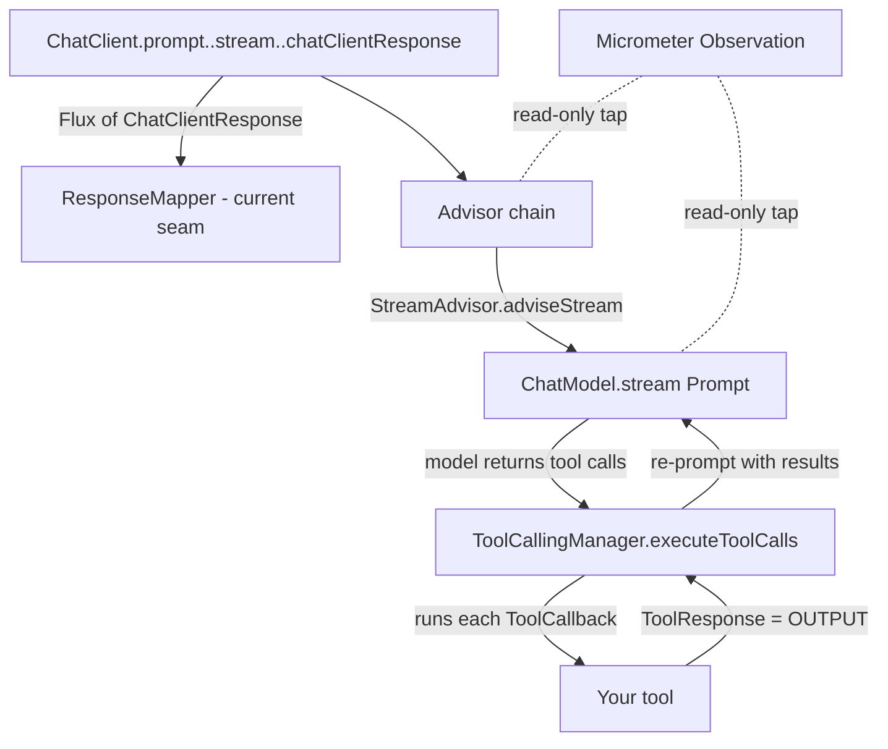

# Native Spring AI integration

> **Status:** design / research note. Nothing here changes the published jars yet — `ui-message-stream`
> today integrates with Spring AI through a single seam (`ResponseMapper` over a `ChatClient` response
> `Flux`). This document records the deeper integration options discovered against the **real Spring AI
> 2.0.0-M8 API** (every signature below was confirmed with `javap` on the resolved jars, not assumed),
> so a future "native tool I/O" feature can be added deliberately without breaking the library's purity
> rules.

## 1. The problem this is solving

The default mapper (`ChatClientResponseMapper.DEFAULT`) reads each `ChatClientResponse` chunk and emits:

- text deltas → `text-*`
- native tool **calls** → `tool-input-available`

It does **not** emit `tool-output-available`. The reason is structural, not a bug: by default Spring AI
runs the **tool-execution loop internally**. The model says "call `getWeather(London)`", Spring AI
intercepts that, runs the tool, appends the result to the conversation, and re-prompts — all *beneath*
the `chatClientResponse()` stream. So the tool's **return value never appears as a distinct element** on
the stream the mapper iterates. A faithful, no-business-logic library refuses to fabricate it.

To emit `tool-output-available` **natively and automatically** we must tap a layer where the tool result
objectively exists. That layer is the **`ToolCallingManager`**, and there are several other Spring AI
seams worth knowing. This note maps all of them.

## 2. Where the seams sit (request → response)



Top to bottom, the seams are: **`ResponseMapper`** (outermost, what we use today) → **Advisor chain**
(`StreamAdvisor`) → **`ChatModel` / `StreamingChatModel`** → **`ToolCallingManager`** → **`ToolCallback`**
(innermost, one tool). Observation is an orthogonal, read-only tap on the chat-client and chat-model
layers.

Crucially: tool execution happens **inside** `ChatModel.stream(...)`, which is **below** the advisor
chain. So an advisor (or the response mapper) sees only the post-tool-execution stream — which is exactly
why neither of them can natively surface tool outputs, and why the `ToolCallingManager` is the unique
seam that sees **both** the tool input (its `ChatResponse` argument) and the tool output (its
`ToolExecutionResult` return value).

## 3. Seam A — `ToolCallingManager` decorator (recommended for native tool I/O)

**This is the "put it to docs" approach.** It is the only seam that sees a tool call's input and output
together, while keeping Spring AI's internal loop fully automatic and native (real `tool-input-available`
+ `tool-output-available`, no `data-*` fallback).

### Verified API (Spring AI 2.0.0-M8)

```text
interface ToolCallingManager {
    List<ToolDefinition> resolveToolDefinitions(ToolCallingChatOptions options);
    ToolExecutionResult  executeToolCalls(Prompt prompt, ChatResponse chatResponse);   // <-- the seam
}
```

- **Inputs** are on the `chatResponse` argument:
  `chatResponse.getResult().getOutput()` → `AssistantMessage.getToolCalls()` → `ToolCall(id, type, name, arguments)`.
- **Outputs** are on the return value:
  `ToolExecutionResult.conversationHistory()` → the `ToolResponseMessage` → `getResponses()` →
  `ToolResponse(id, name, responseData)`. Keyed by the same `id`, so input ↔ output pair up cleanly.
- The default bean (`DefaultToolCallingManager`) is created by `ToolCallingAutoConfiguration` and is
  annotated **`@ConditionalOnMissingBean`** — so exposing our own `ToolCallingManager` bean replaces it
  **globally with zero call-site changes**. That is the "automatic" part.

### Routing the events to the right request

A `ToolCallingManager` is a singleton bean, but the UI stream is per-request. The clean way to route:

1. At request time the app puts a per-request **sink** (`Consumer<UiMessagePart>`) into the tool context:
   `.toolContext(Map.of(SINK_KEY, sink))` (the quizify `AgentOrchestrator` already calls `.toolContext(...)`).
2. The decorator reads it back via
   `prompt.getOptions()` → `ToolCallingChatOptions.getToolContext()` (getter confirmed present).
3. It emits `tool-input-available` for each call **before** delegating, then `tool-output-available` for
   each response **after** delegating.

### Sketch (grounded in the verified API)

```java
public final class RecordingToolCallingManager implements ToolCallingManager {
    public static final String SINK_KEY = "uimessagestream.toolSink";
    private final ToolCallingManager delegate;

    public RecordingToolCallingManager(ToolCallingManager delegate) { this.delegate = delegate; }

    @Override public List<ToolDefinition> resolveToolDefinitions(ToolCallingChatOptions o) {
        return delegate.resolveToolDefinitions(o);
    }

    @Override public ToolExecutionResult executeToolCalls(Prompt prompt, ChatResponse chatResponse) {
        Consumer<UiMessagePart> sink = sinkFrom(prompt);                      // route to this request

        if (sink != null) {                                                  // 1) INPUTS
            for (var c : chatResponse.getResult().getOutput().getToolCalls())
                sink.accept(new UiMessagePart.ToolInputAvailable(c.id(), c.name(), parse(c.arguments())));
        }

        ToolExecutionResult result = delegate.executeToolCalls(prompt, chatResponse);  // 2) run tools

        if (sink != null) {                                                  // 3) OUTPUTS
            for (Message m : result.conversationHistory())
                if (m instanceof ToolResponseMessage trm)
                    for (var r : trm.getResponses())
                        sink.accept(new UiMessagePart.ToolOutputAvailable(r.id(), parse(r.responseData())));
        }
        return result;
    }
}
```

### Trade-offs

| Pros | Cons |
|------|------|
| Only seam that sees tool **input + output** natively | Requires Spring AI's **internal** tool execution to stay enabled (the default) |
| One bean replaces the default globally (`@ConditionalOnMissingBean`) — no call-site changes | Sink must be **serialized** onto the stream thread (tool execution and text deltas run on different Reactor threads — see §7) |
| Pairs input/output by `id` for free | Slightly couples the library to the tool-calling subsystem (a new capability, not just a mapper) |

## 4. Seam B — Advisors API (`StreamAdvisor` / `BaseAdvisor`)

The Advisors API is Spring AI's idiomatic interceptor chain around a `ChatClient` call — the most
"native" place to own the **whole** UI stream lifecycle.

### Verified API

```text
interface Advisor extends Ordered { String getName(); }

interface CallAdvisor   extends Advisor { ChatClientResponse adviseCall(ChatClientRequest, CallAdvisorChain); }
interface StreamAdvisor extends Advisor { Flux<ChatClientResponse> adviseStream(ChatClientRequest, StreamAdvisorChain); }

interface BaseAdvisor extends CallAdvisor, StreamAdvisor {                 // before/after convenience
    ChatClientRequest  before(ChatClientRequest,  AdvisorChain);
    ChatClientResponse after (ChatClientResponse, AdvisorChain);
}

interface StreamAdvisorChain extends AdvisorChain { Flux<ChatClientResponse> nextStream(ChatClientRequest); }
```

- `ChatClientRequest` is a record `(Prompt prompt, Map<String,Object> context)`; `ChatClientResponse` is
  `(ChatResponse chatResponse, Map<String,Object> context)`.
- Registered via `ChatClient.Builder.defaultAdvisors(Advisor...)` (also `List` / `Consumer<AdvisorSpec>`
  forms) or per-request through the prompt spec's `.advisors(...)`.
- `adviseStream` calls `chain.nextStream(request)` to obtain the downstream `Flux<ChatClientResponse>`,
  then is free to **map, tap, prepend, append, recover, or wire cancellation** on it.

### What it can / can't do

- **Can**: open the stream with `start` + `start-step`, run the per-chunk mapping inline, emit `finish`
  on completion, turn `onError` into an `error` part, dispose on cancel — i.e. everything
  `UiMessageStream.from(...)` does today, but **inside the Spring AI call** instead of around it. It can
  also read/write the request `context()` map, making it the natural owner of the per-request sink used
  by Seam A.
- **Can't**: see tool outputs by itself — tool execution is below it inside `ChatModel.stream(...)`. So
  an advisor is the right place to *host* the stream and the sink, but it still needs Seam A (or `data-*`)
  to get tool outputs into that sink.

### Trade-offs

| Pros | Cons |
|------|------|
| Most idiomatic Spring AI extension point; composes with memory/RAG advisors via `Ordered` | A `StreamAdvisor` for SSE production blurs "map a response" into "own the transport" — a bigger surface than today's `ResponseMapper` |
| Owns the full lifecycle + the per-request sink in one place | Still needs Seam A for tool outputs |
| Per-request or global registration | Advisor must be careful with its `getScheduler()` / threading |

## 5. Seam C — `ToolCallback` decorator

Wrap each tool instead of the manager:

```text
interface ToolCallback { ToolDefinition getToolDefinition(); String call(String input); String call(String input, ToolContext ctx); }
```

The `call(input, ToolContext)` overload receives **both** the raw input and (as its return) the raw
output for **one** tool, and `ToolContext` can carry the per-request sink. This is the right seam when an
app **disables** the internal loop and drives tools manually, or wants per-tool granularity. Downsides:
you must wrap every tool at registration (`defaultToolCallbacks(...)`), and you lose the single
choke-point that Seam A gives you.

## 6. Seam D — `ChatModel` / `StreamingChatModel` decorator

The lowest-level seam: wrap the model bean itself.

```text
interface StreamingChatModel { Flux<ChatResponse> stream(Prompt prompt); }
interface ChatModel extends ..., StreamingChatModel { ChatResponse call(Prompt); ... }
```

A decorating `ChatModel` sees the raw provider chunks and *contains* the tool-execution loop, so in
principle it can see everything. In practice it's the **least** attractive seam for this library: it's
provider-shaped, it would have to re-implement or delegate the whole tool loop to observe both halves,
and replacing the model bean is heavier and more fragile than replacing the `ToolCallingManager`. Listed
for completeness; **not recommended**.

## 7. Seam E — Micrometer Observation (read-only)

Spring AI emits observations with rich context:

- `ChatClientObservationContext` (exposes `getRequest()`, `getAdvisors()`),
- `ChatModelObservationContext` (exposes `isStreaming()`), keyed under the AI operation metadata.

A custom `ObservationHandler` / `ObservationConvention` is perfect for **metrics, tracing and token
usage** (this is exactly what the quizify Grafana "Spring AI — Gemini observability" dashboard consumes).
But it is a **read-only tap** — it is not a place to *produce* ordered UI-stream parts. Use it for
telemetry, never as the integration path for the protocol.

## 8. Comparison

| Seam | Sees text | Sees tool **input** | Sees tool **output** | Owns SSE lifecycle | Registration | Verdict |
|------|:--:|:--:|:--:|:--:|------|------|
| `ResponseMapper` (today) | ✅ | ✅ | ❌ | via `UiMessageStream.from` | pass to `from(...)` | Keep as the default, simplest path |
| **A. `ToolCallingManager`** | — | ✅ | ✅ | ❌ | `@Bean` (`@ConditionalOnMissingBean`) | **Use for native tool I/O** |
| **B. `StreamAdvisor`** | ✅ | ✅ | ❌ | ✅ | `defaultAdvisors(...)` | **Use to own the stream + host the sink** |
| C. `ToolCallback` | — | ✅ (1 tool) | ✅ (1 tool) | ❌ | `defaultToolCallbacks(...)` | Manual-tools / per-tool only |
| D. `ChatModel` | ✅ | ✅ | ✅ (hard) | ✅ | replace model bean | Not recommended |
| E. Observation | read-only | read-only | read-only | ❌ | `ObservationHandler` | Telemetry only |

## 9. Recommended native design

For **automatic, native, full** integration (text + reasoning + tool input + tool output, in correct
order), combine **B + A**:

1. A **`StreamAdvisor`** creates a per-request `UiMessageStreamWriter` over a serialized sink
   (`Sinks.many().unicast()`), stashes the sink in the request/tool context, runs the per-chunk text
   mapping, and **merges** the sink's parts with the text-delta stream into one ordered output `Flux`.
2. A **`RecordingToolCallingManager`** (Seam A) reads that sink back from the tool context and pushes
   `tool-input-available` / `tool-output-available` into it at the exact moment Spring AI executes the
   tool.

Because **every** part — text and tool — flows through the same `UiMessageStreamWriter`, **invariant 1
holds for free**: the open text block is closed before the tool parts, and a fresh text block opens for
the model's post-tool answer. And because the advisor is `Flux`-based, **invariant 2** (cancel disposes
the upstream) is preserved.

### The one real implementation concern — thread-safety

The `UiMessageStreamWriter` must be invoked **serially**, but text deltas and tool execution arrive on
**different Reactor threads**. So the shared sink must serialize, e.g. a unicast `Sinks.Many` drained on
the stream thread (or a lock/`Queue` the writer drains). This is the piece to implement carefully; the
capture itself is trivial.

## 10. Purity guardrails (unchanged)

Any of the above stays compatible with the library's rules **only if**:

- `core` remains Jackson-only — no Spring/Reactor/Spring AI ever leaks in. All of Seams A–E live in the
  `spring` module (or a future optional module), never in `core`.
- No business/app concepts appear. The decorator/advisor emit only protocol parts; anything app-specific
  still travels as generic `data-<name>` payloads.
- New capability is **opt-in**. The default `ResponseMapper` path keeps working untouched; a
  `RecordingToolCallingManager` + advisor would ship behind a `@ConditionalOnMissingBean` / opt-in flag
  so apps that don't want a global `ToolCallingManager` override are unaffected.

## 11. Decision still open

Whether to actually **ship** Seam A/B in `ui-message-stream-spring` (as an opt-in
`RecordingToolCallingManager` + auto-config bean and/or a `UiMessageStreamAdvisor`) or to keep the
library a pure mapper and publish this only as a recipe is a **purity trade-off** that needs an explicit
call before any code is added. This document is the research; it intentionally adds **no** new production
code.

## 12. Shipped (v0.2.0): Seam A + the human-in-the-loop approval gate

The §11 trade-off was resolved in favour of shipping Seam A as opt-in. As of **0.2.0**:

- **`RecordingToolCallingManager`** (Seam A) is shipped, wired by the starter behind
  `uimessagestream.tool-io.native=true` (`@ConditionalOnMissingBean`, off by default). It emits
  `tool-input-available` + `tool-output-available`, and now `tool-output-error` when the delegated
  execution throws.
- **The approval gate** is built on the same seam. An `ApprovalPolicy` (default `ApprovalPolicy.NONE`,
  so HITL stays opt-in) is consulted per call inside `executeToolCalls`:
  - a gated, undecided call emits `tool-approval-request` and **pauses the turn** by returning a
    `ToolExecutionResult` with `returnDirect=true`. Confirmed against the 2.0.0-M8 contract
    (`ToolExecutionResult.FINISH_REASON == "returnDirect"`), this terminates the model's tool loop and
    hands control to the caller, so the SSE stream finishes cleanly after the request frame;
  - a denied call emits `tool-output-denied` and feeds the model a denial `ToolResponseMessage`
    (`returnDirect=false`) so it can respond;
  - an approved call executes normally.
- The user's decision arrives on the next request **on the tool part** (`state:"approval-responded"`,
  `approval:{ id, approved, reason? }`). `UiMessageRequest.approvals()` and
  `UiMessageRequestAdapter.toolApprovalDecisions(...)` extract it; the app publishes the resulting
  `Map<toolCallId, Boolean>` in the tool context under `RecordingToolCallingManager.APPROVALS_KEY`, and
  `UiMessageRequestAdapter` replays the prior tool turns so the resumed model call has context.

Cross-request continuity is intentionally the application's responsibility (stateless replay, keyed by a
stable `toolCallId`); the library ships the wire parts, the inbound parsing and the gate — not a
server-side session store. Seams B–E remain research, as above.
